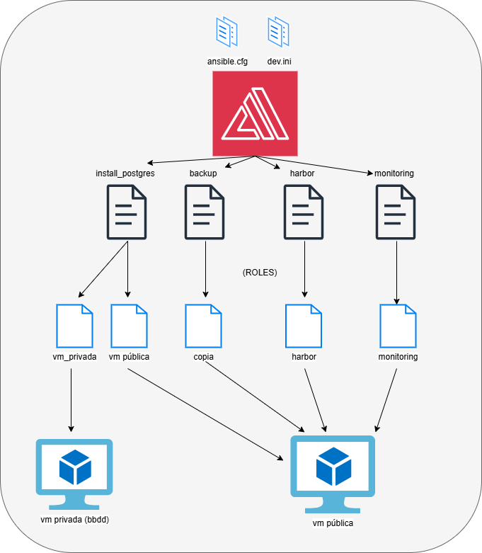

# ansible

## índice

| sección        | descripción                                 |
|----------------|---------------------------------------------|
| [diagrama](#diagrama)         | Esquema visual de todo lo relacionado con ansible       |
| [archivos de configuración](#archivosdeconfiguración)     | Requisitos previos y cosas a tener en cuenta                 |
| [playbooks](#playbooks)     | explicando un poco los playbooks         |
| [roles](#roles) | Roles enganchados a los playbooks |
| [comandos interesantes](#comandosinteresantes)      | comandos interesantes a aplicar con los ficheros de `ansible`             |
| [conclusiones](#conclusiones)      | reflexión personal final sobre ansible             |

## diagrama

## archivos de configuración

### ansible.cfg

se encuentra [en este fichero](../ansible/ansible.cfg)

Aquí configuramos `ansible` para que use nuestro inventario personalizado en `inventory/dev.ini`.
Desactivamos el `host key checking` para que no nos dé problemas con claves `SSH` aunque luego en los roles veremos que aún asi realizamos las conexiones ignorando los `host key` por si acaso.
Desactivamos `retry_files` para que no cree esos archivos de reintento y para la escalación de privilegios usamos `sudo` con `become_method`

### inventory/dev.ini

se encuentra [en este fichero](../ansible/inventory/dev.ini)

Definimos dos grupos:

- web: contiene localhost usando conexión local

- bbdd: máquina llamada vm-db con IP 10.0.1.5 usuario azureuser que usamos clave privada para ssh, y le indicamos que ignore comprobaciones de host para que no haya problemas al conectar

## playbooks

### backup_postgresql.yml

se encuentra [en este fichero](../ansible/playbooks/backup_postgresql.yml)

Este playbook se ejecuta sobre hosts del grupo web (localhost en este caso)
usamos `become` para ejecutar como `root`
solo una tarea que es ejecutar el rol copia con `import_role`
Este rol se encargará de hacer el backup de la base de datos lo veremos más adelante

### install_postgresql.yml

se encuentra [en este fichero](../ansible/playbooks/install_postgresql.yml)

Se divide en dos playbooks:

- install_postgresql.yml en localhost, ejecutando el rol vm_publica para preparar la VM pública que se encarga de descargar paquetes etc

- install_postgresql.yml en bbdd, donde ejecutamos directamente el rol `vm_privada` para instalar `PostgreSQL` en la máquina de base de datos

### harbor_aks.yml

se encuentra [en este fichero](../ansible/playbooks/harbor_aks.yml)

playbook para desplegar el chart de harbor en localhost también usamos become para permisos y ejecuta el rol harbor con import_role como antes
Este rol contiene las tareas para desplegar y configurar `harbor` en el cluster `AKS`

### grafana_stack.yml

similar al anterior de `harbor` pero para prometheus + grafana
Se ejecuta en localhosty se importa el rol monitoring que contiene las tareas para poner `grafana` en marcha con un `dashboard` por defecto y un usuario y contraseña definidas por el usuario

## Roles

**NOTA** es interesante ver esta documentación [junto a la de github actions]() ya que va a la mano en la parte del fichero de [instalación de ansible en el runner](../.github/workflows/setup-ansible.yml) ya que ahí ya se pasan ciertas variables a los roles

Cada rol está organizado en carpetas con tareas y variables y a veces con datos (values.yaml, dashboards, etc), veamoslo uno a uno:

### copia

se encuentra [en este fichero](../ansible/playbooks/roles/copia)

este rol se encarga de hacer backup de la base de datos y subirlo a Azure Blob Storage para ello creamos el directorio `/var/backups` para guardar los backups

Luego instala lo necesario postgresql-client y azure-cli

se autentica en `Azure` con un `Service Principal` para poder subir el backup luego realiza un backup inicial de la base de datos proyecto_final usando `pg_dump` en formato comprimido, sube ese backup al contenedor backups del storage account de `Azure` programa una tarea cron que hace el backup y lo sube a blob de forma diaria asegurando que la infra tenga backups periódicos y por último por seguridad realizamos un logout de `Azure` que se hace en una tarea aparte para asegurarse que no quedan sesiones abiertas

A continuación dejo una tabla con las variables usadas:

| Variable            | Para qué sirve                                  |
|---------------------|------------------------------------------------|
| azure_client_id     | ID del Service Principal para login en Azure   |
| azure_client_secret | Secreto del Service Principal para autenticarse|
| azure_tenant_id     | Tenant de Azure donde está el Service Principal |
| storage_account     | Nombre de la cuenta de Azure Storage            |
| db_password        | Contraseña del usuario de la base de datos      |
| db_host            | Dirección del servidor donde está la base       |
| db_user            | Usuario que accede a la base de datos            |

### harbor

se encuentra [en este fichero](../ansible/playbooks/roles/harbor)

despliegue y configuración de harbor con datos para valores del chart

Primero se asegura de que `Helm` esté instalado y si no lo está lo descarga e instala también genera una contraseña aleatoria (para el admin de Harbor con 10 caracteres para que en un futuro no se pueda usar, ya que vamos a crear un nuevo admin).

Hace login a `Azure` con service principal para poder manejar AKS y demás recursos luego obtiene las credenciales del cluster AKS para poder interactuar con kubectl añade el repositorio oficial de `Harbor` a Helm y actualiza los repositorios y a continuación crea un certificado `TLS` con `SAN` para el dominio de Harbor necesario para `HTTPS` e instala el certificado en el sistema para que sea confiable aunque al ser autofirmado es de paja

Después borra el secreto `harbor-cert` si ya existía para evitar conflictos, crea el namespace `harbor` en `Kubernetes` si no existe y espera a que esté listo para luego crear un secreto `TLS` en `Kubernetes` con el certificado generado anteriormente para usar en `Harbor` e instala `Harbor` usando `Helm` con un fichero `values.yaml` y algunos overrides para la `password admin commonName y externalURL`.

Espera 60 segundos para que `Harbor` arranque y obtiene la ip pública del servicio `Harbor` tipo `LoadBalancer` para actualizar el `/etc/hosts` con la IP pública para que el dominio de Harbor resuelva correctamente

Espera que la `API` de `Harbor` responda antes de continuar haciendo varios intentos una vez engancha, crea un usuario en Harbor con datos básicos y por variables para luego añadir ese usuario como admin al proyecto definido.

hace `login` al registry de `Harbor` con `helm` usando las credenciales del usuario creado. Obtenemos el nombre y versión del `chart Helm` desde `Chart.yaml` del repositorio estem mismo, esto nos sirve para empaquetar el chart `helm` con ese nombre y subirlo al proyecto de `Harbor`

El logout limpia la sesión de Helm el contexto de kubectl y cierra sesión en Azure para no dejar credenciales ni tokens colgados que en mi opinión son buenas prácticas a siempre llevar a cabo

Este es uno de los roles más complejos ya que me costó un montón poder cuadrar todo bien, dejo una tabla con las diferentes variables

| Variable               |  Para qué sirve                                      |
|------------------------|-------------------------------------------------------|
| `azure_client_id`      | ID del cliente del Service Principal de Azure         |
| `azure_client_secret`  | Secreto/contraseña del Service Principal de Azure     |
| `azure_tenant_id`      | ID del tenant de Azure para autenticación              |
| `azure_subscription_id`| ID de la suscripción de Azure donde está el AKS       |
| `k8s_resource_group`   | Grupo de recursos de Azure donde está el AKS           |
| `k8s_cluster_name`     | Nombre del cluster AKS                                  |
| `harbor_url`           | Dominio o URL donde se expone Harbor                    |
| `harbor_admin_pass`    | Contraseña generada para el usuario admin de Harbor    |
| `harbor_admin_user`    | Usuario administrador de Harbor (normalmente "admin") |
| `jga_user`             | Nombre del usuario nuevo que se crea en Harbor          |
| `jga_pass`             | Contraseña para el usuario `jga`                        |
| `project`              | Nombre del proyecto en Harbor donde se asigna el usuario|

### monitoring

se encuentra [en este fichero](../ansible/playbooks/roles/monitoring)

Básicamente es un despliegue de `prometheus` y `grafana` con 1 `dashboard` personalizado [ubicado en la carpeta de data](../ansible/playbooks/roles/monitoring/data/dashboard.json)

Primero hacemos `login` en `Azure` usando un `Service Principal` con las credenciales que tenemos definidas en las variables para autenticarnos por los `workflows` de `ghactions`. Luego configuramos el contexto de `kubectl` para trabajar con el `cluster` `AKS` especificado en los `ghactions`

Creamos el `namespace` donde vamos a desplegar el `stack` de monitorización si no existe ya, para asegurarnos que todo está ordenado y separado. Después hacemos un `wait` con `retries` para asegurarnos que el `namespace` realmente existe antes de seguir

Añadimos el repositorio oficial de `helm` para `prometheus-community`, que contiene los `charts` necesarios para desplegar todo el `stack` de monitorización

Creamos un `secret` de `Kubernetes` que contiene el `dashboard` `JSON` para `Grafana`, para luego poder importarlo automáticamente y tener las métricas listas para visualizar

Ejecutamos el `helm upgrade/install` para instalar o actualizar el `kube-prometheus-stack` con la configuración personalizada y con las credenciales de administrador de `Grafana` que hemos definido en las variables

Esperamos a que el servicio de `Grafana` tenga asignada una `IP` pública, chequeando repetidamente hasta que la `IP` esté disponible

Una vez obtenida la `IP` pública, actualizamos el archivo `/etc/hosts` del `runner` para poder acceder a `Grafana` con un nombre de host definido sin necesidad de usar la `IP` directa, esto nos servirá para futuras comprobaciones en los `workflows`

En `logout` limpiamos el contexto actual de `kubectl` para eliminar credenciales temporales y hacemos `logout` en `Azure` para cerrar sesión y no dejar tokens activos

| Variable             | Definición breve                                            |
|----------------------|------------------------------------------------------------|
| `azure_client_id`    | ID del Service Principal para autenticación en Azure       |
| `azure_client_secret`| Secreto (password) del Service Principal para Azure        |
| `azure_tenant_id`    | Tenant ID de Azure para el Service Principal                |
| `azure_subscription_id` | ID de la suscripción de Azure donde está el AKS          |
| `k8s_resource_group` | Grupo de recursos de Azure donde está desplegado el AKS    |
| `k8s_cluster_name`   | Nombre del cluster AKS donde se obtienen las credenciales  |
| `grafana_namespace`  | Namespace de Kubernetes donde se desplegará Grafana y Prometheus |
| `role_path`          | Ruta base del rol o directorio donde están los archivos de configuración |
| `grafana_user`       | Usuario administrador para Grafana configurado en Helm     |
| `grafana_pass`       | Contraseña del usuario administrador de Grafana             |
| `grafana_host`       | Nombre de host que se añadirá al `/etc/hosts` para acceder a Grafana |

### vm_privada

se encuentra [en este fichero](../ansible/playbooks/roles/vm_privada)

Antes comentar que ante se habrán pasado los paquetes necesarios desde la `vm pública`. Primero buscamos todos los paquetes `.deb` descargados en la carpeta temporal para instalarlos manualmente porque esta `VM` no tiene acceso a internet

Instalamos todos esos paquetes con `dpkg`, ignorando errores porque puede haber dependencias rotas

Si detectamos errores por dependencias rotas, lanzamos `apt-get install -f` para corregirlas localmente sin conexión a internet

Arrancamos y habilitamos el servicio `PostgreSQL` para que esté activo y arranque automáticamente

Creamos el usuario de la base de datos si no existe para poder manejar permisos y backups con el usuario adecuado.

Importamos el backup de la base de datos `proyecto_final`, eliminando la base anterior si existe y creando una nueva limpia para restaurar el backup

Configuramos `postgresql.conf` para escuchar en todas las interfaces y permitir conexiones remotas

Modificamos `pg_hba.conf` para permitir acceso remoto desde las subredes internas de `aks` y de la propia máquina virtual.

Por último reiniciamos el servicio `PostgreSQL` para aplicar todas las configuraciones nuevas, como no hemos iniciado sesión no nos hace falta ningún `logout`

Aquí las únicas 2 variables que se usan en este rol

| Variable      | Descripción                                               |
|---------------|-----------------------------------------------------------|
| `bbdd_user`   | Nombre del usuario de la base de datos PostgreSQL.        |
| `bbdd_password` | Contraseña del usuario de la base de datos PostgreSQL.  |

### vm_publica

se encuentra [en este fichero](../ansible/playbooks/roles/vm_publica)

Primero añadimos la clave `SSH` de la `VM` privada a `known_hosts` y para evitar prompts molestos en la conexión `SSH` lo hacemos desde `localhost`.

actualizamos la caché de `apt` para tener los paquetes al día para luego instalar los  `apt-rdepends` para poder calcular dependencias de paquetes que necesitamos descargar manualmente

instalamos `Azure CLI` usando el script oficial, `Docker` siguiendo el repositorio oficial para tener la última versión estable y añadimos el usuario del `runner` al grupo `docker` para que pueda usar `Docker` sin problemas de permisos, luego en un `workflow` [diseñado para esta tarea en específico](../.github/workflows/setup-runners-final.yml) reiniciamos la máquina para que se apliquen todos los cambios de grupos

Descargamos e instalamos `kubectl` para gestionar `Kubernetes`, creamos un directorio temporal para guardar los paquetes de `PostgreSQL` y sus dependencias y nuevamente calculamos todas las dependencias necesarias de `postgresql-12` para descargarlas y poder usarlas offline, para ello descargamos todos esos paquetes a la carpeta temporal para luego copiarlos a la `VM` privada comprimiendo esos paquetes para facilitar la transferencia a la `VM` privada.

Corregimos los permisos de la clave privada `SSH` para que `ssh` y `scp` funcionen correctamente sin problemas de seguridad y procedemos a copiar el archivo comprimido con los paquetes a la `VM` privada usando `scp` sin preguntar por la clave `host` y descomprimimos los paquetes en la `VM` privada para que luego puedan instalarse sin conexión.

Hacemos `login` en `Azure` con el `Service Principal` para poder descargar el backup desde `Azure Blob Storage` y lo copiamos el backup descargado desde la `VM` pública a la `VM` privada usando `scp` sin prompt de `host`

Esperamos unos segundos para asegurarnos que la transferencia y descarga han terminado antes de seguir y finalmente hacemos `logout` de `Azure` para cerrar sesión y evitar dejar tokens abiertos

Dejo aquí todas las variables que se usan

| Variable             | Descripción breve                                               |
|----------------------|----------------------------------------------------------------|
| `bbdd_host`          | Dirección IP o hostname de la VM privada donde está la BBDD.   |
| `runner_user`        | Usuario que ejecuta los comandos y al que se le asignan permisos. |
| `azure_client_id`    | ID del Service Principal de Azure para autenticación.          |
| `azure_client_secret`| Secreto del Service Principal para autenticación en Azure.     |
| `azure_tenant_id`    | ID del tenant de Azure donde se realiza la autenticación.      |
| `azure_subscription_id` | ID de la suscripción Azure donde se van a gestionar recursos. |
| `storage_account`    | Nombre de la cuenta de almacenamiento en Azure Blob Storage.   |

## comandos interesantes

| Comando                                                                 | Para qué sirve                                                                 |
|------------------------------------------------------------------------|--------------------------------------------------------------------------------|
| `ansible-vault encrypt vars.yaml --ask-vault-pass`                     | Encripta el archivo `vars.yaml` usando `ansible vault` solicitando la contraseña. Esto es interesante para darle un plus de seguridad, para desencriptarlo sería igual pero con `decrypt` en vez de `encrypt` |
| `ansible-playbook -i inventory/dev.ini playbooks/install_postgresql.yml` | Ejecuta el playbook en este caso `install_postgresql.yml` pero sería con cualquiera de los que tenemos usando el inventario `dev.ini`.   |

## conclusiones

Un buen resumen sería que aunque `ansible` ha sido todo un dolor de 🥚 la estructura es clara y modular ya que usamos roles para separar funcionalidades y simplificar playbooks.
La configuración de ansible evita problemas con ssh y escalación de privilegios así los playbooks principales ejecutan estos roles según la máquina destino (localhost para tareas públicas o la vm-db para bbdd).

Así queda todo preparado para desplegar desde el `runner` y su [workflow](../.github/workflows/setup-ansible.yml)
