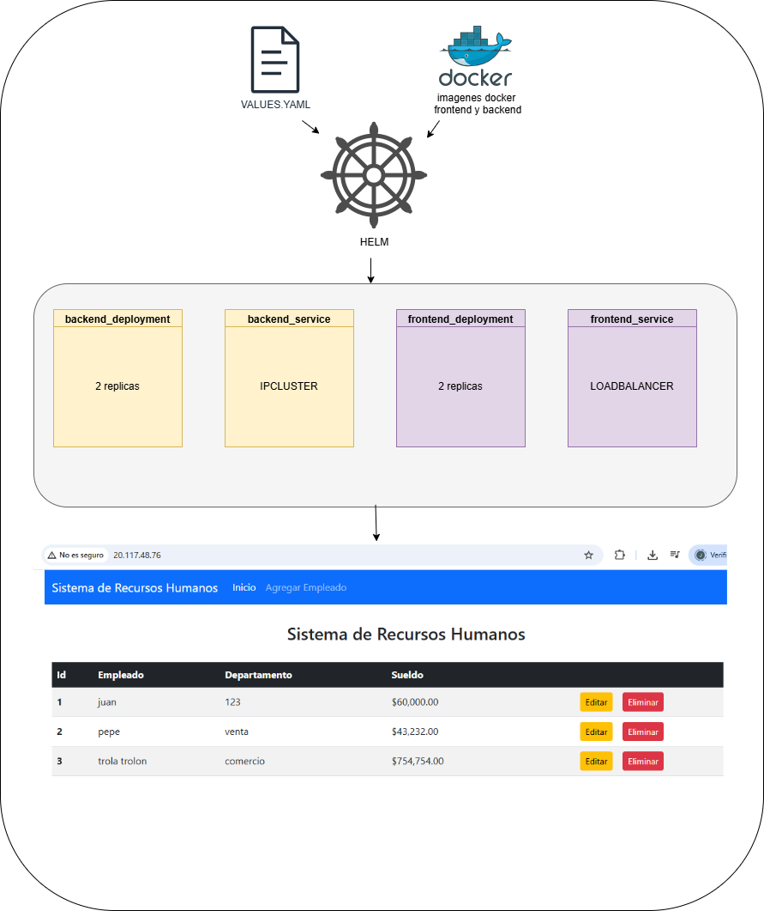

# kubernetes y helm

## índice

| sección        | descripción                                 |
|----------------|---------------------------------------------|
| [diagrama](#diagrama)         | Esquema visual de todo lo relacionado con kubernetes y `helm`       |
| [archivos de configuración](#archivosdeconfiguración)     | Requisitos previos y cosas a tener en cuenta                 |
| [templates](#templates)     | explicando un poco los templates utilizados         |
| [values](#values) | viendo los values por defecto |
| [comandos interesantes](#comandosinteresantes)      | comandos interesantes a aplicar con los ficheros de `kubernetes y helm`             |
| [conclusiones](#conclusiones)      | reflexión personal final sobre kubernetes y helm             |

## diagrama

## archivos de configuración

Se puede usar tanto en local como con un clúster en la nube, solo habría que hacer ciertas adaptaciones como crear también de forma local la base de datos bien en un `statefulset` o en una máquina virtual local, pero como partimos con una infra de `terraform` vamos a enfocarnos en eso

Tenemos nuestro `chart` en [la carpeta de proyecto_helm](../charts/proyecto_helm/)

Este chart despliega dos componentes: el backend y el frontend de la aplicación de `RRHH` que fue la que me tocó. Ambos se despliegan con `Kubernetes` y se usan imágenes almacenadas en el `Azure Container Registry` que se levanta.

### estructura de carpetas:

- Chart.yaml: define la metadata del chart
- values.yaml: valores por defecto para los templates
- templates: donde está el meollo: los YAML de Kubernetes que se van a desplegar

---

## templates

ACTUALIZACIÓN, TUVE QUE PONER 1 RÉPLICA SÓLO YA QUE SI NO ME QUEDABA SIN ESPACIO EN EL NODO, Y COMO REESCALAR EL CLÚSTER

### backend_deployment.yaml

despliega los `pods` del backend con 2 réplicas, usamos las imagenes creadas con los `dockerfile` de [el repo de backend](https://github.com/stemdo-labs/final-project-gestion-rrhh-backend-JavierGarciaInformatico/blob/main/Dockerfile)

Expone el puerto que indicamos también ahí el `8080` y aplicavariables de entorno con los datos de la DB

Con los recursos he ido a lo fácil:

- pide 1 CPU y 1Gi de RAM
- igual limita a lo mismo así evitamos cuellos de botella y sobreejecuciones

### backend_service.yaml

Servicio para exponer el backend internamentem es tipo `ClusterIP` para que sólo sea accesible dentro del cluster y expone en el puerto que antes usamos en su `deployment`

### frontend_deployment.yaml

Despliega el pod del frontend:

igual, 2 réplicas usando [la dockerfile del frontend](https://github.com/stemdo-labs/final-project-gestion-rrhh-frontend-JavierGarciaInformatico/blob/main/Dockerfile)
y expone el puerto 80

**detalles importantes:**

lleva un `initContainer` que espera a que el `backend` esté listo antes de arrancar el `frontend`. Y es clave para evitar errores de conexión al levantar la `UI` demasiado pronto, y por último sobre los recursos iguales al backend (1CPU y 1Gi de RAM de límite y request)

### frontend_service.yaml

esto va a exponer el frontend y es tipo LoadBalancer para que se pueda acceder desde fuera del clusterdesde el navegador por el puerto `80`

### Chart.yaml

Definimos:

- apiVersion: v2 porque es un chart moderno
- name: rrhh: nombre del chart
- version: 0.1.0: versión del chart (la del empaquetado Helm)
- appVersion: 1.0.0: versión de la app que estamos desplegando
- description: texto explicando que es el chart de `RRHH`

## values.yaml

| Variable           | Descripción                                                                                         |
|--------------------|-----------------------------------------------------------------------------------------------------|
| `imagen_backend.repo`   | Imagen del backend subida al ACR privado.                                                        |
| `imagen_backend.tag`    | Versión del backend, por ejemplo `v1`.                                                           |
| `imagen_backend.pullPolicy` | Política de descarga de la imagen, normalmente `IfNotPresent` para evitar pulls innecesarios.     |
| `service_backend.type`  | Tipo de servicio para el backend, normalmente `ClusterIP` para uso interno en el cluster.        |
| `service_backend.port`  | Puerto donde escucha el backend, por defecto `8080`.                                             |
| `env`                   | Variables de entorno necesarias para conectar con la base de datos (host, user, password, etc.). |
| `imagen_frontend.repo`  | Imagen del frontend en el ACR, igual que la del backend pero para el cliente web.               |
| `imagen_frontend.tag`   | Versión del frontend.                                                                            |
| `imagen_frontend.pullPolicy` | Política de pull de la imagen del frontend, normalmente `IfNotPresent`.                        |
| `service_frontend.type` | Tipo de servicio para el frontend, en este caso `LoadBalancer` para exponerlo al exterior.       |
| `service_frontend.port` | Puerto público del frontend, usualmente `80`.                                                    |
| `resources`             | Campo opcional para definir `requests` y `limits`; se deja vacío para usar los valores por defecto de los templates. |

## comandos interesantes

| Comando                                                                                   | Explicación                                                                                          |
|-------------------------------------------------------------------------------------------|------------------------------------------------------------------------------------------------------|
| `kubectl config get-contexts`                                                             | Muestra todos los contextos disponibles en tu configuración de Kubernetes (`~/.kube/config`).       |
| `helm install rrhh-jga .\proyecto_helm\ --namespace jga --create-namespace`              | Instala un chart de Helm desde el directorio `proyecto_helm` bajo el nombre `rrhh-jga` en el namespace `jga`. Si el namespace no existe, lo crea. |

## conclusiones

quizás la parte más fácil del proyecto por ir todo muy rodado, y sin problema aparente

