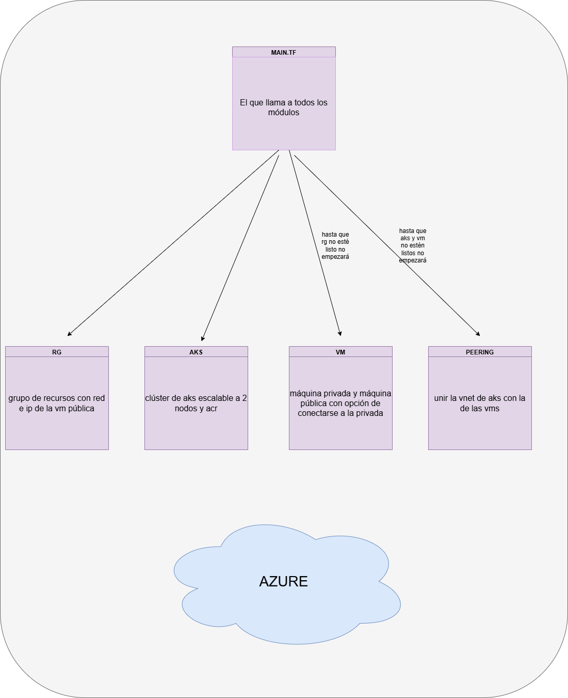

# terraform modular

## índice

| sección        | descripción                                 |
|----------------|---------------------------------------------|
| [diagrama](#diagrama)         | Esquema visual de todo lo relacionado con ansible       |
| [archivos de configuración](#archivosdeconfiguración)     | Requisitos previos y cosas a tener en cuenta                 |
| [módulos](#modulos)     | explicando un poco los módulos usados         |
| [variables y outputs](#variablesyoutputs) | factores a tener en cuenta con estos |
| [comandos interesantes](#comandosinteresantes)      | comandos interesantes a aplicar con los ficheros de `terraform`             |
| [conclusiones](#conclusiones)      | reflexión personal final sobre `terraform`             |

## diagrama



## archivos de configuración

A la hora de usar terraform hay que tener en cuenta estas variables de entorno

```bash
ARM_CLIENT_ID
ARM_CLIENT_SECRET
ARM_TENANT_ID
ARM_SUBSCRIPTION_ID
```

Estas variables se podrán sacar con comandos de `az` siempre que se tengan los permisos adecuados, exceptuando el `client secret` salvo poder ser `admin` en `azure`.

**NOTA: he decidido dejar mis `terraform brutos` como a mi me gusta llamarle, en los cuales al principio hacía las cosas por partes montando una por una para ir haciendo mis pruebas pertinentes, todo lo que haya fuera de la carpeta de `módulos` son realmente los `módulos` pero a cachos en un `main.tf`. Para aquellos que tengan curiosidad tengo en ellos algunos `readme` orientativos que pueden ayudar**

## módulos

### aks

Se encarga de desplegar un clúster de `AKS` junto a su `ACR` y `VNET` dedicada

Se usa un `data` para pillar el grupo de recursos que se le pasa como variable, no se crea aquí, crea un `Azure Container Registry (ACR)` sin permisos de admin ya que no es necesario por loguearnos con `azure` como método, se define una red virtual `vnet_aks` con su subnet correspondiente y el clúster de `AKS` se lanza con una pool básica de una `VM B2s` conectada a su subnet privada.

Se activa identidad gestionada (SystemAssigned) y por último se le asigna permiso de `AcrPull` al identity del kubelet para poder tirar imágenes del ACR.

Outputs:
- Info básica del clúster: nombre, host, certs, claves, etc.
- ID de la VNET y nombre del ACR.

Variables:
- Nombre del grupo, ubicación, nombre de ACR, nombres de la red y subnet, nombre del AKS y DNS prefix.

---

### peering

Es de los módulos más simples, se encarga de emparejar la `VNET del AKS` con la del módulo de `PostgreSQL`

- Crea dos peerings, uno desde AKS hacia Postgres y otro de vuelta.
- Se habilita tráfico reenviado y acceso entre redes.

Outputs:
- ID de los peerings creados.

Variables:
- Grupo de recursos, nombre de ambas VNETs, e ID de ambas.

### rg

Este módulo es el que pone en marcha la infraestructura base creando el grupo de recursos y generando una IP pública estática. Crea la VNET de Postgres con una subnet privada y por último genera una `NIC` pública conectada a la susodicha subnet.

Outputs:
- Nombre del grupo, ubicación, ID de la IP, subnet, NIC, y dirección IP pública.
- También devuelve el ID de la VNET para usarlo en el peering.

Variables:
- Nombre del grupo y ubicación (por defecto en `ukwest`)

### vm

Este es el módulo más tocho qeu despliega dos máquinas virtuales: una privada y otra pública

Primero se reutiliza el RG mediante un `data` para puego crea un NSG con reglas:
- Permite SSH desde fuera (pública).
- Permite SSH y Postgres internamente entre VMs.
- Asocia ese NSG a la subnet que se le pasa.

Creamos claves `ssh` para tanto la vm pública como la privada, dándole la clave necesaria a la pública para poderse conectar a la privada

Outputs:
- IP privada de la VM interna.
- IP pública de la VM externa.
- Private key usada para conectarse a la vm públivs

Variables:
- Grupo, ubicación, nombre de la subnet, nombre de la VNET, nombre de la NIC pública e IP pública.

## variables y outputs

Están preparados para que si fuese necesario poder sustituir por ejemplo la localización del `rg` y todos los recursos que se pudiera hacer de la forma más cómoda posible.

Los outputs si se les da un uso muy interesante, lo veremos en los `workflow` pero básicamente crearemos secretos automáticos de los recursos desplegados

## comandos interesantes

| Comando | Descripción |
|--------|-------------|
| `terraform destroy "-target=module.vm" "-target=module.aks" "-target=module.peering" -auto-approve` | Destruye únicamente los módulos `vm`, `aks` y `peering`, manteniendo intacto el módulo `rg`. |
| `terraform output -raw vm_private_key \| Out-File -FilePath "$env:USERPROFILE\.ssh\id_rsa" -Encoding ascii` | Extrae la clave privada desde Terraform y la guarda en el archivo `id_rsa` en el directorio `.ssh` del usuario. |
| `icacls "$env:USERPROFILE\.ssh\id_rsa" /inheritance:r` | Quita la herencia de permisos del archivo para asegurar su privacidad. |
| `icacls "$env:USERPROFILE\.ssh\id_rsa" /grant:r "$($env:USERNAME):(R)"` | Otorga al usuario actual permisos de solo lectura sobre la clave. |
| `icacls "$env:USERPROFILE\.ssh\id_rsa" /remove "Users"` | Elimina los permisos del grupo `Users` sobre el archivo para mayor seguridad. |
| `terraform output -raw vm_public_ip` | Muestra la IP pública de la VM creada por Terraform. |
| `ssh -o StrictHostKeyChecking=no -i ~/.ssh/id_rsa azureuser@ip` | Conecta por SSH a la VM usando la clave privada exportada. Reemplaza `ip` por la IP obtenida en el comando anterior. |

## conclusiones

Quizás junto a el de `kubernetes` fue de los más fáciles, ya que también tenía experiencia con `terraform` así que sabía por donde iban los tiros, me lo he pasado bien ;-)


