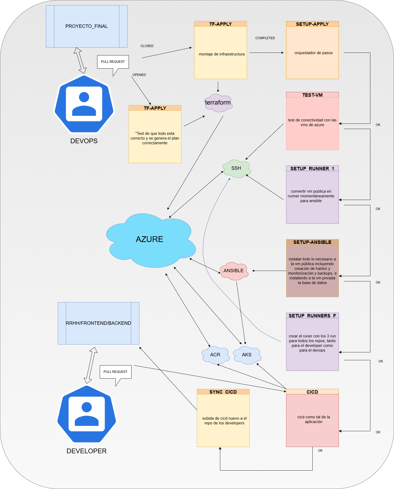

# github actions

## índice

| sección        | descripción                                 |
|----------------|---------------------------------------------|
| [diagrama](#diagrama)         | Esquema visual de todo lo relacionado con GITHUB ACTIONS       |
| [archivos de configuración](#archivosdeconfiguración)     | Requisitos previos y cosas a tener en cuenta                 |
| [workflows](#workflows)     | explicando un poco los workflows usados         |
| [actions](#actions) |explicando un poco los workflows usados |
| [secretos](#secretos)      | Lista de secretos usados en el proyecto en los 3 repos             |
| [conclusiones](#conclusiones)      | reflexión personal final sobre `github`             |

## diagrama



## archivos de configuración

Por donde empezar, ha sido una verdadera locura todo esto, antes de proceder con `github actions` es necesario comprender al 100% todo lo que se hace en el resto de teconologías que hay en los readme, ya que si no probablemente te vuelvas loco como yo

Así que como requisito previo es mandatorio tener todo lo demás montado en local para saber cómo se comporta. Ahora sí procedamos a explicar cada `workflow` y para que sirve porque tiene miga

## workflows

Es interesante irse apoyando del diagrama que mostré anteriormente para comprender un poco la estructura y el qué hace cada `workflow`, primero vamos a explicar la cadena de montaje y por último los manuales, voy a ir paso por paso

### tf-plan.yml

Es el primer `workflow` que salta a la hora de hacer un `pull request` su único objetivo es crear un mensaje a la hora de realizar el `merge` para saber que se va a crear y que no

### tf-apply.yml

Salta cuando un `pull request` se cierra, lo que hace es levantar la infraestructura **PERO** al final saca todos los `outputs` para convertirlos en secretos de propio repositorio y también para los `repos` de `frontend` y `backend`

### setup-apply.yml

Salta justo después del anterior, y tiene un motivo concreto de funcionar con esto 

```yaml
  workflow_run:
    workflows: [terraform apply]
    types:
      - completed
```

Si no se hiciera así, si no como siempre con un "orquestador" lo que pasaría es que no se actualizarían los secretos que creamos con `tf-apply`, ya que en caliente los secretos no se actualizan, tiene que haber un mínimo momento en el que se pare todo para que se apliquen.

`setup-apply` ya si es un orquestador que va a llamar a todos los `workflows` que voy a explicar a continuación por orden y con dependencia siempre en orden para evitar errores

### test-vm.yml

Con este simplemente hago una prueba para ver que efectivamente puedo acceder tanto a la vm privada como a la vm pública creada con `terraform`

### setup-runner-principio.yml

Con `python` y unos cuantos `steps` se pueden hacer maravillas, montar un `runner` desde otro `runner` es un concepto extraño pero muy interesante, ya que así se puede automatizar todo aún más como a mi megusta

### setup-ansible.yml

La madre del cordero de todo el flujo, es el que más tarda porque instala los 5 roles que tenemos de `ansible` en la máquina de `backups`. tiene una serie de lógicas para que si está ya montado el servicio no se vuelva a montar, sirve a la vez de test y de instalador

### setup-runners-final.yml

A diferencia que el anterior `setup-runner` además de que es mútliple para los 3 repos, hace un reinicio de la `vm pública` antes, esto es debido a que se tienen que aplicar ciertas configuraciones de `ansible` relacionado con grupos para que se cierre y vuelva a iniciar sesión, y un buen reinicio siempre ayuda, por último el `runner` lo ponemos a funcionar para los 3 repos, no se si es una práctica normal, pero me ha funcionado bien

### cicd.yml

Ya había que llegar al `ci cd` no iba a ser un camino infinito, en él primero se crea las imágenes de `docker` para luego sacar el nombre y versión de `helm` y así poder conectarnos a `harbor` y buscar el mismo nombre y versión que se puso en el `playbook` de `ansible` y ya iniciar nuestro `chart`

### sync-cicd.yml

Se ejecuta siempre después del `ci cd` y su misión es subir ese mismo archivo a los repos de `frontend` y `backend` en el caso que haya cambios, para que en el próximo `pull request` se realice con la nueva versión del mismo

Ahora a continuación vamos a ver los manuales, que son básicamente los mismos que los que hice [en el weekly de terraform](https://github.com/stemdo-labs/terraform-weekly-exercise-JavierGarciaInformatico/tree/main/enunciados)

### tf-destroy.yml

Sirve para borrar toda nuestra infra a golpe de botón, pero sólo sirve si es invocado por `tf-manual`

### tf-manual.yml 

Sirve para ejecutar manualmente todas las acciones de `terraform` tanto `apply` como `plan` y `destroy` 

## actions

Había muchas cosas repetitivas durante todos los `workflows` anteriores, por eso decidí crear algunas actions:

### copiar_workflow

Se encarga en el `workflow` de `sync-cicd` de copiar el `workflow` de `cicd` a los repos de `frontend` y `backend`

### docker_build

Se encarga de montar las imágenes de `docker` en el `workflow` de `cicd`

### git_commit_push

Se encarga de realizar el `push` en los `repos` `frontend` y `backend` a la hora del `workflow` de `sync-cicd` de subir los archivos al repo

### obtener_versión

Se encarga de sacar los `tags` para las imágenes de `docker` en `cicd`

### sleep

Se usa en el `setup-apply` y en otro `workflow` para hacer una pequeña pausa para que se apliquen cambios

### ssh

Se usa en el `workflow` de `test-vm`. Realmente no era necesario pero en ese momento tenía otras ideas y ya lo dejé, es simplemente hacer un `ssh` puente de forma manual para que coja la clave `ssh` de la pública para acceder a la `vm privada`

## secretos

Es una buena lista, os lo dejo a continuación:

[repo 1 (final-project-exercise)](https://github.com/stemdo-labs/final-project-exercise-JavierGarciaInformatico)

[repo 2 (rrhh frontend)](https://github.com/stemdo-labs/final-project-gestion-rrhh-frontend-JavierGarciaInformatico)

[repo 3 (rrhh backend)](https://github.com/stemdo-labs/final-project-gestion-rrhh-backend-JavierGarciaInformatico)


| Nombre             | Descripción                           | Usos                          |
|--------------------|-------------------------------------|-------------------------------|
| ACR_NAME           | Nombre del Azure Container Registry | `repo1, repo2, repo3`       |
| AKS_NAME           | Nombre del clúster de AKS            | `repo1, repo2, repo3`             |
| AZURE_CLIENT_ID    | ID de cliente para autenticación Azure | `repo1, repo2 , repo 3`       |
| AZURE_CLIENT_SECRET| Secreto de cliente para Azure         | `repo1, repo2 , repo 3`       |
| AZURE_SUBSCRIPTION_ID | ID de suscripción de Azure          | `repo1, repo2 , repo 3`         |
| AZURE_TENANT_ID    | ID del tenant de Azure                 | `Erepo1, repo2 , repo 3`      |
| BBDD_HOST          | Host o IP de la base de datos         | `repo1, repo2 , repo 3`            |
| BBDD_PASS          | Contraseña de la base de datos         | `repo1, repo2 , repo 3`         |
| BBDD_USER          | Usuario de la base de datos             | `repo1, repo2 , repo 3`                |
| CONTRA_ANSIBLE     | Contraseña para Ansible                 | `repo 1`        |
| GRAFANA_PASS       | Contraseña para Grafana                 | `repo 1`          |
| GRAFANA_URL        | URL de la instancia de Grafana          | `repo 1`|
| GRAFANA_USER       | Usuario para Grafana                     | `repo 1`               |
| HARBOR_PASS        | Contraseña para Harbor                   | `repo1, repo2 , repo 3`         |
| HARBOR_URL         | URL del registro Harbor                  | `repo1, repo2 , repo 3`|
| HARBOR_USER        | Usuario para Harbor                      | `repo1, repo2 , repo 3`         |
| ORG_OWNER          | Dueño o propietario de la organización  | `repo1, repo2 , repo 3`             |
| REPO1_NAME         | Nombre del primer repositorio           | `repo1, repo2 , repo 3`        |
| REPO2_NAME         | Nombre del segundo repositorio          | `repo1, repo2 , repo 3`       |
| REPO3_NAME         | Nombre del tercer repositorio           | `repo1, repo2 , repo 3`          |
| REPO_TOKEN         | Token de acceso para repositorios       | `repo1, repo2 , repo 3`          |
| RG_NAME            | Nombre del Resource Group en Azure      | `repo1, repo2 , repo 3` |
| RUNNER_HOST        | Host donde corre el runner CI/CD        | `repo1, repo2 , repo 3`         |
| RUNNER_USER        | Usuario para el runner                   | `repo 1`         |
| SSH_KEY            | Llave SSH para acceso remoto             | `repo 1`       |
| STORAGE_NAME       | Nombre del recurso de almacenamiento    | `repo 1`      |

## conclusiones

Fue una locura, pero valió la pena, no veas lo guapo que está hacer tantas cosas de forma automática, ahí se ve la magia del `devops`, y me encanta automatizar, sin ninguna duda seguiré por mi cuenta viendo como mejorar esto, me quedé con ganas de hacer los `environments` qie sería como en 2 ramas hacer diferentes `workflows` para tener la parte de desarrolo por una parte y la de producción por otra pero ya el tiempo no me daba para eso, a duras penas he podido conseguir esto despues de muchas horas en esto, que no me arrepiento la verdad también


